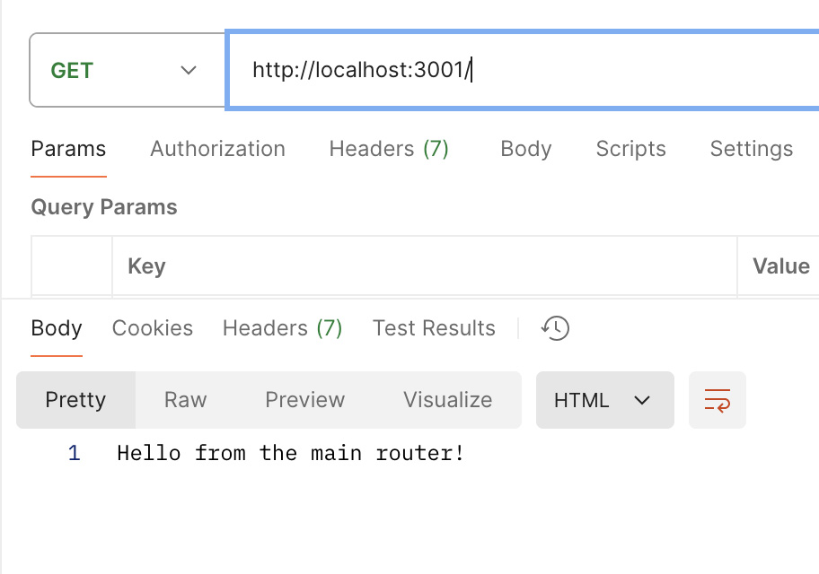
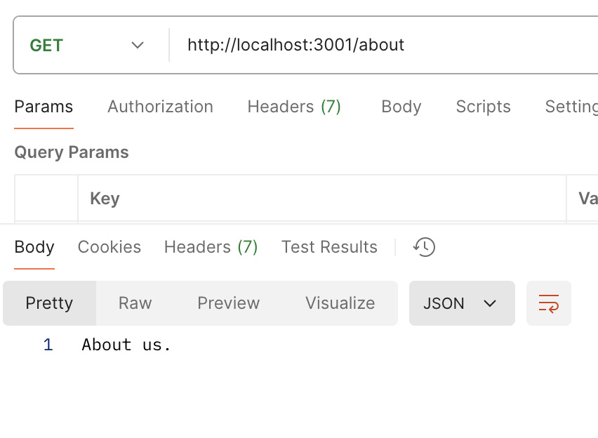
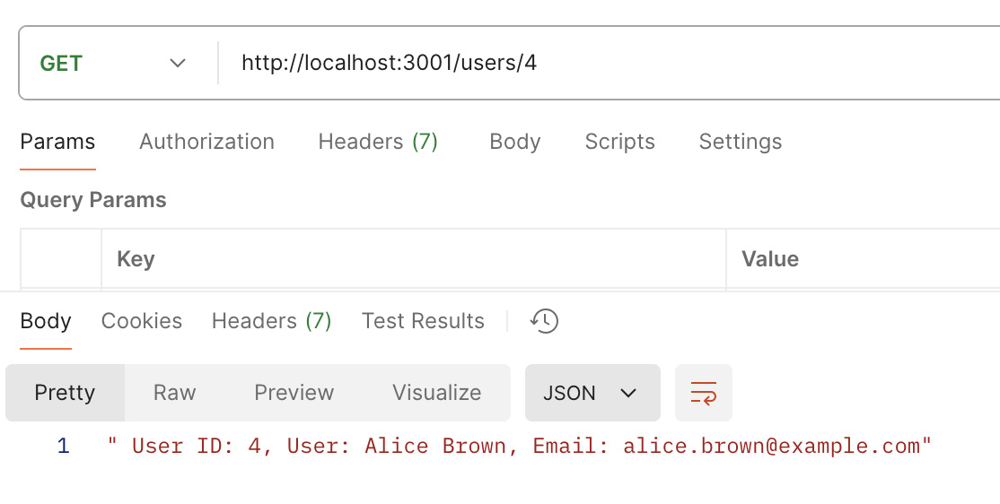
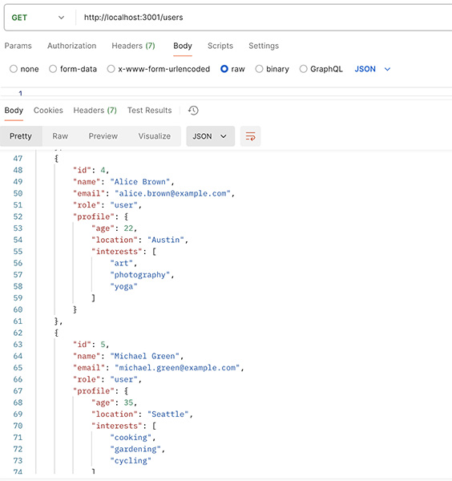
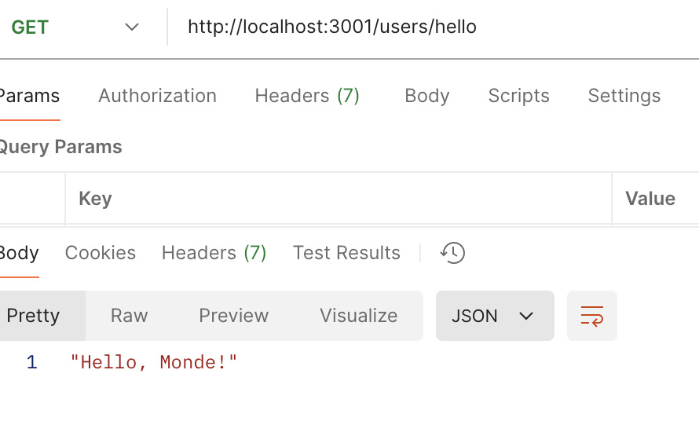

## **Express-Routing**

## **Objective**
- [x] Set up a new Express server.
- [x] Use Express Router to organize routes.
- [x] Handle route parameters.
- [x] Create a basic nested route structure.

## **Create the Server**

- [x] Create a file named index.js.
- [x] Set up a basic Express server that listens on port 3000 (or 3001)
- [x] Create a basic route that responds with "Hello, World!" at the root URL.
- [x] Create routes in index.js
- [x] In index.js, set up a router that handles:
- [x] A GET request at the root URL (/) that responds with "Hello from the main router!".
- [x] A GET request at /about that responds with "About Us".

## **Handle Route Parameters**

- [x] Modify the router to handle a GET request at /user/:id that responds with the user ID.
- Test this route by navigating to URLs like http://localhost:3001/user/1.

## **Create Nested Routes**

- [x] Inside the routes directory, create a file named users.js.
- [x] Import the data with:
- [x] import data from "../data.json" with { type: "json" };
- [x] console.log(data);
- [x] Set up the users.js router to handle:  hello world at /users/hello
- [x] Modify the main router (index.js) to use the users.js router for routes starting with /users.
- [x] Test for hello world at /users/hello 
- [x] Set up the users.js router to handle:
- A GET request at the root URL (/users) that responds with "List of all users".
- A GET request at /:id that responds with the user ID.

## **Test the Routes**

- [x] Start the server using Nodemon.
- [x] Test the following routes:
- http://localhost:3000/ - Should display "Hello from the main router!".

- http://localhost:3000/about - Should display "About Us".

- http://localhost:3000/user/123 - Should display "User ID: 4".

- http://localhost:3000/users - Should display "List of all users".

- http://localhost:3000/users/hello - Should display "Hello Monde".

